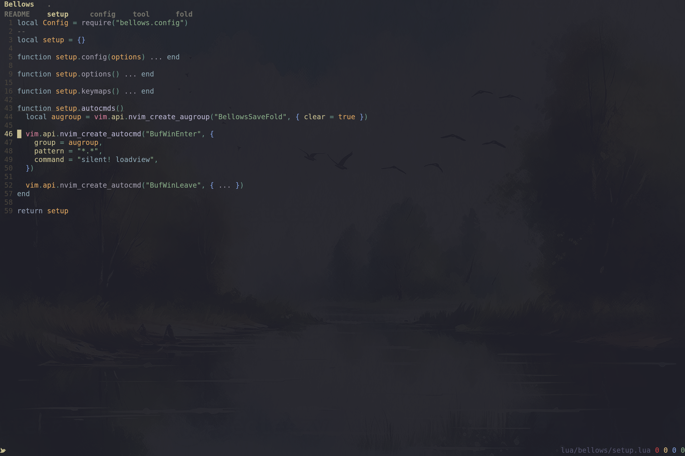

# Bellows

Just a few expressive keymaps along a very thin polish over neovim rickety folding behavior.

## Features

- 💾 Automatic fold persistence between sessions
- 🌲 Treesitter-based folding with intelligent expression handling
- 🎨 Customizable colors and appearance with fallback to existing highlights
- ⌨️  Intuitive keymaps for fold navigation and management

## Requirements

- Neovim >= 0.8.0
- nvim-treesitter

## Installation

Using [lazy.nvim](https://github.com/folke/lazy.nvim):

```lua
{
    "micowata/bellows",
    event = { "BufReadPost", "BufNewFile" },
    dependencies = {
        "nvim-treesitter/nvim-treesitter",
        "nvim-treesitter/nvim-treesitter-textobjects",
    },
    opts = {
        -- your configuration here
    }
}
```
## Configuration

Default configuration with all options:

```lua
{
    settings = {
        -- Folding settings
        method = 'expr',                    -- Use expression-based folding
        foldexpr = "nvim_treesitter#foldexpr()", -- Treesitter-based fold expression
        nestmax = 3,                        -- Maximum nesting level
        minlines = 1,                       -- Minimum lines for a fold
        level = 99,                         -- Initial fold level
        column = '0',                       -- Fold column width
        
        -- Customize fold text appearance
        foldtext = [[substitute(getline(v:foldstart),'\t',repeat('\ ',&tabstop),'g').' ... '.trim(getline(v:foldend))]],
        
        -- Optional: disable default keymaps
        disable_keymaps = false,
    },
    
    colors = {
        -- Colors can be hex values or highlight group names
        fold = vim.api.nvim_get_hl(0, { name = "Folded" }),    -- Fold text color
        column = vim.api.nvim_get_hl(0, { name = "Special" }), -- Fold column color
    },
}
```
## Keymaps

Default keymaps (can be disabled with `disable_keymaps = true`):

| Keymap    | Description           | 
|-----------|----------------------|
| `zj`      | Move to next fold    |
| `zk`      | Move to previous fold|
| `z<Down>` | Toggle current fold  |
| `z<Up>`   | Close all folds     |
| `z<Left>` | Close all other folds|
| `z<Right>` | Open next fold layer|

### Customizing Fold Text

The `foldtext` option determines how folded text is displayed. The default shows the first line, followed by "..." and the last line. You can customize this with Vim's fold-related variables:

- `v:foldstart`: First line of the fold
- `v:foldend`: Last line of the fold
- `v:folddashes`: A string of dashes representing fold level
- `v:foldlevel`: Current fold level

Example of custom fold text:


## Commands

The plugin automatically handles fold persistence through these events:

- `BufWinLeave`: Automatically saves fold state
- `BufWinEnter`: Automatically restores fold state

## FAQ

**Q: Why aren't my folds persisting between sessions?**
A: Make sure you have `set viewoptions?` properly configured. The minimal required options are `folds,cursor`.

**Q: Can I use this with other folding plugins?**
A: Yes, but you may need to adjust the `foldmethod` and `foldexpr` settings to avoid conflicts.

## License

MIT - See [LICENSE](./LICENSE) for more information.

## Acknowledgments

- [nvim-treesitter](https://github.com/nvim-treesitter/nvim-treesitter) for providing the foundation for intelligent code folding
- The Neovim community for inspiration and support
