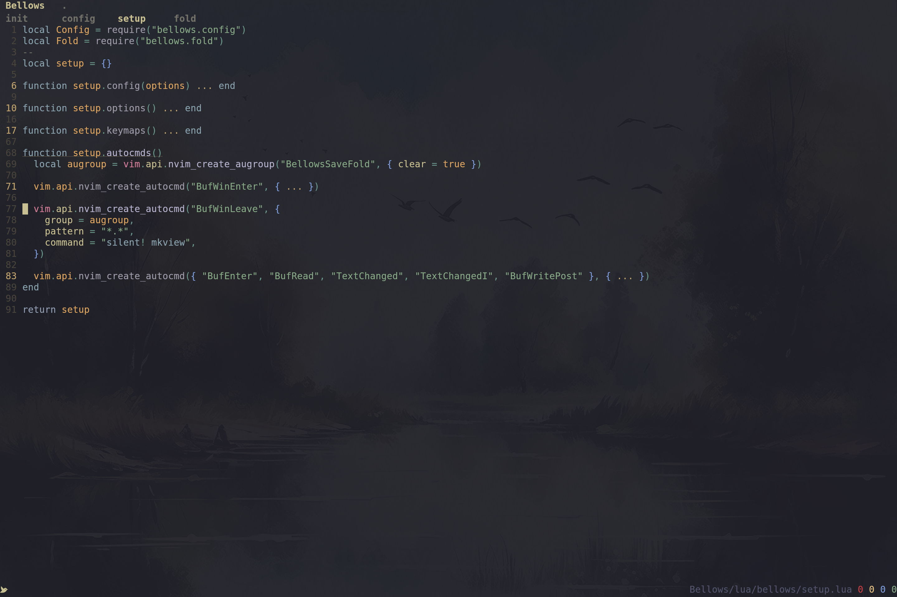

# Bellows

A neovim plugin to fold your code like an accordionist.
Actually just a few expressive keymaps and a highlight polish to improve neovim's rickety folding behavior.

## Features

- Intuitive keymaps for expressive fold controls
- Insightful treesitter highlighted folds
- Effective code navigation, since folding moves the cursor 
- Fold persistence per buffer

## Keymaps

Try them, many practical combos to discover !

| Keymap         | Description           | 
|----------------|-----------------------|
| `<Shift-End>`  | Move to next fold     |
| `<Shift-Home>` | Move to previous fold |
| `<Shift-Up>`   | Close all folds       |
| `<Shift-Left>` | Close all other folds |
| `<Shift-Right>` | Toggle fold           |
| `<Shift-Down>` | Toggle fold cascade   |

## Installation

Using [lazy.nvim](https://github.com/folke/lazy.nvim):

```lua
{
    "micowata/bellows",
    event = { "BufReadPost", "BufNewFile" },
    dependencies = {
        "nvim-treesitter/nvim-treesitter",
        "nvim-treesitter/nvim-treesitter-textobjects",
    },
}
```
## Configuration

You can customize Bellows by passing options to the setup function:

```lua
require("bellows").setup({
    keys = {
        fold = "<S-Right>",      -- Toggle fold
        cascade = "<S-Down>",    -- Toggle fold cascade
        close = "<S-Up>",        -- Close all folds
        others = "<S-Left>",     -- Close all other folds
        next = "<S-End>",        -- Jump to next fold
        previous = "<S-Home>",   -- Jump to previous fold
    },
    options = {
        middle = " ... ",        -- Text to show in folded text
        last = true,            -- Show last line of fold
        record = true,          -- Enable fold state recording
    }
})

## Requirements

- Neovim >= 0.8.0
- nvim-treesitter

## Autocommands

The plugin automatically handles fold persistence through these events:

- `BufWinLeave`: Automatically saves fold state
- `BufWinEnter`: Automatically restores fold state

## FAQ

**Q: Why aren't my folds persisting between sessions?**
A: Make sure you have `set viewoptions?` properly configured. The minimal required options are `folds,cursor`.

**Q: Can I change the default keymaps or the fold text ?**
A: I'm working on it :)

## License

MIT - See [LICENSE](./LICENSE) for more information.

## Acknowledgments

- The Neovim community for inspiration and support
- This reddit hero : [reddit post](https://www.reddit.com/r/neovim/comments/16sqyjz/finally_we_can_have_highlighted_folds)
